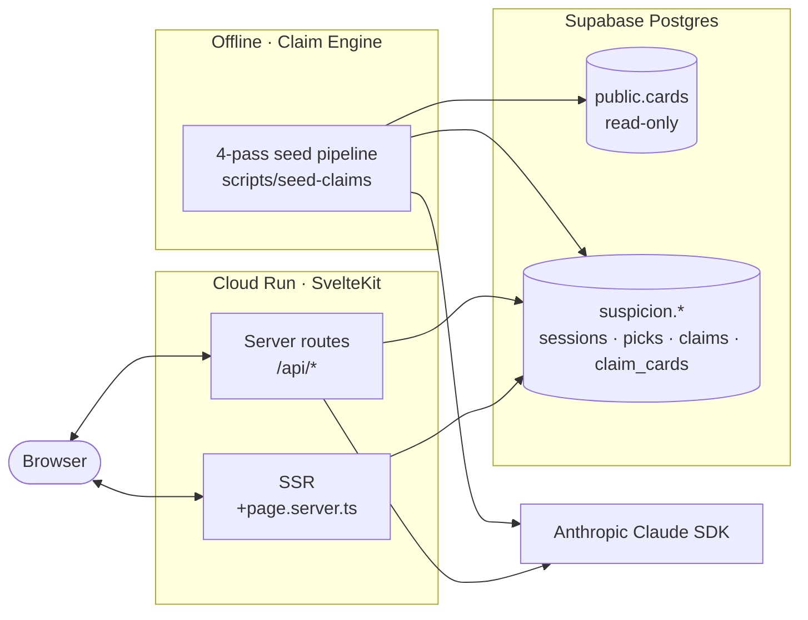

<div align="center">


# Architect of Suspicion

[](https://github.com/anchildress1/architect-of-suspicion/actions/workflows/ci.yml) [](https://sonarcloud.io/summary/new_code?id=anchildress1_architect-of-suspicion) [](LICENSE)

</div>

A single-player investigative game that turns a software engineer's career into a mansion of evidence. You're handed an accusation — _"Ashley depends on AI too much"_, _"Ashley avoids hard problems"_ — and sent to rule on the witnesses. The Architect, a magistrate who doesn't care about you, reacts to every call. When the gallery has heard enough, you Accuse or Pardon, and the record seals into a cover letter written from your verdict.

It's a resume that argues with you.

---

## About

A static resume tells you what someone did. This one makes you decide whether to believe it.

The game pulls from 288 real career decisions stored as cards in a Supabase index — projects, philosophies, constraints, mistakes. A claim engine pre-vets each card against the active accusation and rewrites its blurb so the witness speaks to that specific charge. You enter chambers, rule each exhibit **Proof**, **Objection**, or **Dismiss**, and the Architect's attention meter drifts with the shape of your rulings. No score is ever revealed. No call is ever marked right or wrong. The cover letter at the end references only the evidence you ruled on.

Built as a portfolio piece. Aimed at recruiters and hiring managers who are tired of reading resumes.

---

## How It Plays

- **Witness mode.** One exhibit on stage, the rest queued down the right rail. Cards are called least-charged first, escalating as the case warms up.
- **Three rulings.** Proof supports the claim. Objection counters it. Dismiss strikes the witness from the record — they don't reach the cover letter.
- **The Architect's Attention.** A needle gauge on the left rail. Drifts between Drifting → Watching → Interested → Riveted based on the aggregate trajectory of your rulings. Never tells you whether a single call landed.
- **The verdict.** Accuse or Pardon, hold-to-arm. The result is a sealed cover letter composed from your ruled evidence, alongside a static resume. One reading, no undo.

---

## Tech Stack

| Layer     | Choice                                                      |
| --------- | ----------------------------------------------------------- |
| Framework | SvelteKit (Svelte 5, adapter-node)                          |
| Styling   | Tailwind CSS v4 with custom industrial-noir tokens          |
| AI        | Anthropic Claude SDK (`@anthropic-ai/sdk`)                  |
| Data      | Supabase (PostgreSQL, RLS, anonymous sessions)              |
| Runtime   | Node.js, served via a Polka adapter on Cloud Run            |
| Tooling   | pnpm, Vitest + v8 coverage, ESLint, Prettier, Lefthook      |
| Quality   | SonarCloud, CodeQL, Lighthouse CI (desktop ≥0.9 / a11y 1.0) |

Typography is split across four fonts on purpose: Instrument Serif for accusations, Geist Sans for the player's voice, Geist Mono for the Architect, and JetBrains Mono for the readouts. The visual language is industrial noir — bone on ink with a single ink-blood red accent — not steampunk.

---

## Architecture



Server routes live entirely inside SvelteKit — there is no separate API service. The runtime AI never produces a score; every directional weight is pre-seeded into `suspicion.claim_cards` by an offline 4-pass claim engine, and Claude is called only for in-character reactions and the final cover letter. The full game's `fact` field for each card never crosses the wire.

For the deeper cut — server route contracts, schema, RLS policies — see [`docs/ARCHITECTURE.md`](docs/ARCHITECTURE.md). Game rules and the Architect persona live in [`docs/PRD.md`](docs/PRD.md). The seed pipeline is documented in [`docs/CLAIM-ENGINE-PRD.md`](docs/CLAIM-ENGINE-PRD.md).

---

## Getting Started

Requires Node.js (latest LTS) and pnpm.

```bash
pnpm install
cp .env.example .env   # then fill in the values below
pnpm run dev
```

A `Makefile` wraps the common dev commands — `make dev`, `make test`, `make build` — if you'd rather not type the pnpm scripts directly.

---

## Configuration

Server-side only. Never check these into the repo, never expose them to the client.

| Variable                      | Purpose                                             |
| ----------------------------- | --------------------------------------------------- |
| `SUPABASE_URL`                | Project URL for the Supabase instance               |
| `SUPABASE_SECRET_KEY`         | `sb_secret_…` key — server reads/writes only        |
| `ANTHROPIC_API_KEY`           | Claude SDK key for reactions and cover letter       |
| `API_RATE_LIMIT_MAX_REQUESTS` | Per-IP request budget (default `30`)                |
| `API_RATE_LIMIT_WINDOW_MS`    | Rate-limit window in milliseconds (default `60000`) |

---

## License

Released under the [Polyform Shield License 1.0.0](LICENSE). Source-available, not open-source — read the license before you build a paid SaaS on top of it.

- **You can:** use it, fork it, learn from it, ship it inside your day job, hand it to a client.
- **You can't:** sell it, rebrand it, host it as paid SaaS, or otherwise monetize it without explicit written permission.
- **Public forks:** include the LICENSE file and credit the original work.

---

## Author

**Ashley Childress** — engineer, the subject of the accusation, and the one who built the mansion.

- Email: anchildress1@gmail.com
- GitHub: [@anchildress1](https://github.com/anchildress1)
